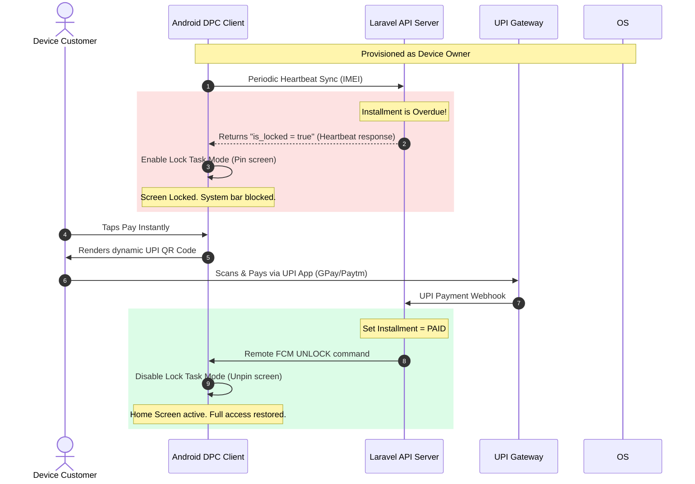

# Sales Pitch & Client Demonstration Guide: EmiLocker

This document is designed as a comprehensive sales, architecture, and live-demonstration guide for **EmiLocker (EMI Phone Locking System)**. You can share this with your technical team, use it as a structure for client slide decks, or refer to it during sales meetings to pitch and close deals with device finance companies, micro-lenders, and retail merchants.

---

## 1. Executive Summary & Market Fit

### The Problem
Mobile device financing is a fast-growing industry, but it suffers from high default rates. Traditional tracking or locking apps fail because:
- **Easy Bypass**: Users can easily uninstall standard apps, disable background services, or turn off notifications in settings.
- **Root/ADB overrides**: Technical users bypass restrictions via USB debugging (ADB commands).
- **Physical wipes**: Users factory reset the phone or launch in Safe Mode to wipe local data and lock features.

### The EmiLocker Solution
**EmiLocker** is a production-grade, enterprise-ready security system that operates at the OS kernel level. By configuring the Android application as a native **Device Policy Controller (DPC)** and provisioning it as the **Device Owner**, the system locks down hardware and system controls, making it physically impossible for the customer to uninstall or bypass the lock.

---

## 2. Technical Product Architecture

The system consists of three integrated nodes:
1. **DPC Android Client**: Native Kotlin app operating as the device manager.
2. **Laravel 11 REST API Server**: Central controller database managing installment contracts and payment status.
3. **FCM (Firebase Cloud Messaging) v1**: Google’s secure OAuth2 low-latency signaling channel.



---

## 3. Core Features & Security Hardening (Un-Bypassable)

| Threat | Traditional Apps | EmiLocker DPC Protection |
| :--- | :--- | :--- |
| **App Uninstallation** | User can drag app to trash or click Uninstall. | **Prevented**: Uninstallation is completely blocked at the Android OS layer. |
| **Factory Reset** | User goes to Settings -> Reset to wipe device. | **Blocked**: Settings page factory reset option is greyed out/disabled. |
| **Safe Mode Reboot** | Hold power and volume down to load clean. | **Disabled**: Booting into Safe Mode is blocked; the phone reboots straight to DPC lock screen. |
| **USB Debugging / ADB** | Connect to PC to run terminal uninstall codes. | **Blocked**: USB data transfer, file sharing, and ADB debugging connections are disabled. |
| **Notification Block** | Turn off notification permissions in app settings. | **Blocked**: App permissions are system-enforced and cannot be changed or muted by the user. |
| **Going Offline** | Turn off WiFi/Cellular data to prevent remote lock. | **Offline Watchdog**: Runs background timers. If the phone is offline for >24 hours, the local alarm locks it automatically. |
| **Settings Tampering** | User changes system time, date, or status bar. | **Blocked**: System settings modifications, status bar pulldown, and multitasking app switcher are blocked. |

---

## 4. Step-by-Step Live Demonstration Script

Here is how to run a high-impact demo for prospective clients using the **Control Console** and the **Interactive Simulator** (or a connected physical phone / emulator):

### Scenario A: Real-Time Remote Locking (Visualizing DPC Control)
1. **Show the Active State**: 
   - Load the admin console at `http://localhost:8000/`.
   - Show the client list. Select **Alice Smith** (who is currently `ACTIVE`).
   - Look at the **Device Simulator**. It displays a beautiful Android smartphone home screen with app icons (Settings, Chrome, Camera, Phone).
2. **Execute Remote Lock**:
   - In the client list, click the red **Lock** button next to Alice Smith.
   - Explain to the client: *"I am now sending a remote lock request. In production, this goes through Google’s secure FCM v1 channel."*
   - Watch the simulator screen. It instantly transitions into a dark slate-gray screen displaying a pulsing red **"DEVICE LOCKED"** header.
3. **Show Lock Details**:
   - Point out the customer account card containing Alice's name and installment details.
   - Point out the **dynamic UPI QR code** showing the exact pending EMI amount.

### Scenario B: Demonstrating Local Security & Offline Bypass
1. **Simulate Lock Screen Lockdown**:
   - Explain that on a physical device, all buttons (Home, Back, Recents, Status Bar swipe down) are disabled. The user cannot escape this layout.
2. **The "What if the user has no internet?" Question**:
   - Explain: *"What if the user pays cash to a local retailer, or has no cellular data to receive the unlock signal?"*
   - **Perform the Bypass**: Double-click or tap the **"DEVICE LOCKED"** header in the simulator 5 times.
   - A secure slide-up dialog appears: **"Enter DPC Bypass Code"**.
   - Input the code `887766` (Alice's master bypass code) and click **Verify & Bypass**.
   - Watch the simulator transition back into the unlocked state. Explain: *"Every phone is seeded with a secure cryptographic bypass code that a retailer can give to the customer over a phone call if they are offline."*

### Scenario C: Simulating Payment and Webhook Auto-Unlock
1. **Return to Locked State**:
   - Lock Alice Smith's device again from the table.
2. **Trigger Mock Payment**:
   - On the lock screen simulator, click the green **"Pay Instantly On Device"** button (or click **"Capture"** in the EMI Ledger modal).
   - Explain to the client: *"The customer scans the QR code and pays. Their UPI app sends a notification to our payment gateway, which sends a webhook to our server."*
   - The simulator instantly receives the unlock signal, animates, and unlocks back to the active home screen.

---

## 5. Technical Guide: Setting Up Android Studio & Provisioning

To show a client this running on a **physical device** or a **live Android Emulator**, follow these steps to open, build, and register the app:

### Step 1: Open the Project
1. Open **Android Studio**.
2. Click **File -> Open**.
3. Select the folder `c:\laragon\www\emi-locker\android`.
4. Wait for Gradle sync to complete. (All dependencies are modern and match target API 34).

### Step 2: Build the Application
1. Click **Build -> Make Project** in Android Studio.
2. Or run in terminal:
   ```bash
   cd c:\laragon\www\emi-locker\android
   gradlew assembleDebug
   ```
   This generates the debug APK at `app/build/outputs/apk/debug/app-debug.apk`.

### Step 3: Provision as Device Owner (CRITICAL)
For the app to enforce restrictions (disable USB, block factory reset, lock the screen task), it must be set as the **Device Owner**. A standard user cannot do this through a simple click.

1. Wipe a test Android device or launch a fresh **Android Virtual Device (Emulator)** in Android Studio.
2. Complete the initial boot setup **without** signing into a Google account (ensure no accounts exist in Settings -> Accounts).
3. Connect the device to your PC and enable USB debugging.
4. Install the APK to the device:
   ```bash
   adb install -r app-debug.apk
   ```
5. Provision the app as the **Device Owner** by running this command in your computer's terminal:
   ```bash
   adb shell dpm set-device-owner com.emilocker.dpc/.receiver.DeviceAdminReceiver
   ```
6. The terminal will return:
   `Success: Device owner set to package com.emilocker.dpc`
7. Now, launch the app. It will hook into the system hardware policies, block settings, and sync live with your Laravel backend at `http://127.0.0.1:8000/`.
